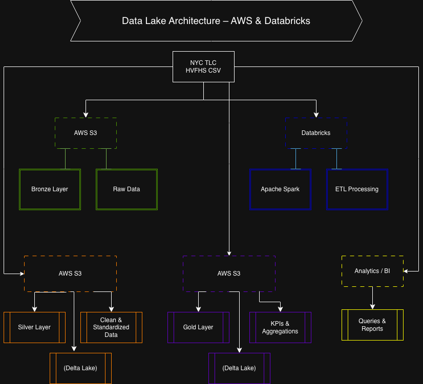

# Prueba-Ingeniero-Datos
Prueba técnica de Ingeniería de Datos – Arquitectura Data Lake en AWS con Databricks.

---------------------------------------------------------------------------------------------------------------------------------------------------------------------------------
>**Nota sobre el formato de los datos:**  
> El dataset oficial de NYC TLC para High Volume For-Hire Vehicle Trip Records (HVFHS) se publica en formato **Parquet**. 
> Aunque el dataset oficial de NYC TLC se publica en formato Parquet, el pipeline es agnóstico al formato de entrada.
>Para efectos de esta prueba técnica, el pipeline de ingesta y procesamiento fue diseñado de forma **agnóstica al formato de entrada**, permitiendo trabajar indistintamente con archivos CSV o Parquet en la capa Bronze, sin afectar la arquitectura ni las transformaciones posteriores en las capas Silver y Gold.
---------------------------------------------------------------------------------------------------------------------------------------------------------------------------------

## 1. Objetivo del proyecto

El objetivo de este proyecto es diseñar e implementar una arquitectura de Data Lake en AWS, utilizando Databricks como motor de procesamiento, para analizar datos de viajes de alto volumen provenientes de plataformas como Uber, Lyft, Via y Juno, a partir del dataset High Volume For-Hire Vehicle Trip Records (HVFHS) publicado por NYC TLC.

La solución busca demostrar buenas prácticas de ingeniería de datos, incluyendo diseño de arquitectura, procesamiento de datos, escalabilidad, manejo de errores, versionamiento y claridad en la comunicación técnica.

## 2. Fuente de datos

Los datos utilizados provienen de la página oficial de NYC Taxi & Limousine Commission (TLC):

- https://www.nyc.gov/site/tlc/about/tlc-trip-record-data.page

Se utilizan archivos en formato CSV correspondientes a los High Volume For-Hire Vehicle Trip Records, específicamente para enero de 2025, los cuales contienen información detallada de los viajes, como timestamps, distancia, duración y valores monetarios.

## 3. Arquitectura del Data Lake

La arquitectura propuesta sigue un enfoque de Lakehouse, organizada en tres capas principales: Bronze, Silver y Gold, utilizando Delta Lake como formato de almacenamiento.

** Arquitectura general

- Fuente de datos (NYC TLC CSV)
        ↓
- S3 - Bronze (datos crudos)
        ↓
- Databricks / Apache Spark
        ↓
- S3 - Silver (datos limpios y estandarizados)
        ↓
- S3 - Gold (datos agregados y KPIs)
        ↓
- Consumo analítico

## 4. Capas del Data Lake
** Capa Bronze (Ingesta)

-Contiene los datos crudos tal como se reciben desde la fuente.

-No se realizan transformaciones complejas.

-Se agregan metadatos como:

-Fecha de ingesta

-Nombre del archivo de origen

-Formato de almacenamiento: Delta Lake

** Objetivo: conservar los datos originales para reprocesos futuros.

# Capa Silver (Transformación)

-Contiene datos limpios y estandarizados.

-Se realizan las siguientes transformaciones:

-Corrección de tipos de datos

-Normalización de timestamps (formato, zona horaria y valores nulos)

-Validaciones básicas de calidad

-Manejo de históricos mediante cargas incrementales.

-Formato de almacenamiento: Delta Lake

# Capa Gold (Presentación)

-Contiene datos agregados listos para análisis.

-Se generan los siguientes KPIs diarios:

-Viajes promedio por hora

-Ingresos totales (fare + fees + taxes)

-Tiempo promedio del viaje

-Distancia promedio del viaje

-Diseñada para consumo analítico eficiente.

## 5. Estrategia de particionado

-Las tablas Silver y Gold se particionan por fecha del viaje, lo que permite:

-Mejor performance en consultas analíticas

-Reducción de escaneo de datos

-Escalabilidad a grandes volúmenes de información

## 6. Estrategia de incrementalidad

La ingesta se realiza de forma incremental, procesando únicamente nuevos archivos o nuevas fechas.

Se evita reprocesar información ya cargada.

Se contempla la posibilidad de reprocesar datos históricos en caso de fallas o correcciones.

## 7. Manejo de errores y reprocesos

Validaciones básicas durante la transformación (tipos, nulos, rangos).

Posibilidad de re-ejecutar el pipeline por rangos de fecha.

Conservación de datos crudos en Bronze para reprocesos controlados.

## 8. Versionamiento del código

El proyecto se versiona utilizando Git, con la siguiente estructura:

-/bronze
-/silver
-/gold
-/diagrams
-README.md

Cada capa contiene su lógica de procesamiento correspondiente, facilitando mantenimiento y escalabilidad.

## 9. Optimizaciones

-Se propone el uso de OPTIMIZE sobre tablas Silver o Gold para:

-Compactar archivos pequeños

-Mejorar el rendimiento de consultas analíticas

-Optimizar el uso de recursos en Databricks

## 10. Gobierno de datos y seguridad (conceptual)

** Control de accesos por capa:

+ Bronze: acceso restringido a ingenieros de datos

+ Silver: analistas y científicos de datos

+ Gold: usuarios de negocio

** Separación de entornos: dev / qa / prod

Auditoría de accesos y trazabilidad de transformaciones mediante logs y metadatos.

En caso de no usar Unity Catalog, se pueden implementar controles a nivel de permisos y convenciones de acceso.

## 11. Tecnologías utilizadas

-AWS S3

-Databricks

-Apache Spark / PySpark

-Delta Lake

-Git

**-----------------------------------------------------------------------------------------------------------------------------------------------------------------------------**

 Se aplica OPTIMIZE con ZORDER sobre la columna trip_date en la capa Gold para compactar archivos pequeños y mejorar el rendimiento de consultas analíticas que filtran por fecha,        reduciendo el volumen de datos escaneados y optimizando el uso de recursos en Databricks.

**-----------------------------------------------------------------------------------------------------------------------------------------------------------------------------**

## Incrementalidad avanzada y manejo de cambios (CDC)

El Data Lake fue diseñado con una estrategia de procesamiento incremental, orientada a escalar con el crecimiento del volumen de datos.

La ingesta se realiza principalmente mediante cargas **append**, procesando nuevos archivos o rangos de fechas sin reprocesar la totalidad del dataset. La capa Bronze conserva los datos crudos, lo que permite reprocesos controlados en caso de fallas o cambios en la lógica de negocio. Para escenarios de llegadas tardías o correcciones de datos históricos, se contempla el uso de operaciones **MERGE** en la capa Silver, permitiendo insertar nuevos registros o actualizar existentes según claves de negocio disponibles.

El manejo de duplicados se realiza en la capa Silver mediante validaciones y deduplicación basada en identificadores naturales o combinaciones de campos relevantes.

Delta Lake permite versionamiento de los datos, soportando estrategias de append, merge, soft deletes y consultas a snapshots históricos, facilitando auditoría, trazabilidad y rollback de información.

## Gobierno de datos y seguridad

El Data Lake implementa un enfoque de gobierno de datos basado en control de accesos por capas, asegurando que cada tipo de usuario acceda únicamente al nivel de información correspondiente a su rol.

- La capa Bronze mantiene acceso restringido a ingenieros de datos, la capa Silver está disponible para analistas y científicos de datos, y la capa Gold expone únicamente información agregada para usuarios de negocio.

Se contempla la separación de entornos (dev / qa / prod) mediante buckets y configuraciones independientes, garantizando aislamiento entre desarrollo y producción.

La seguridad se gestiona mediante políticas de acceso en AWS (IAM) y controles de permisos en Databricks. En caso de no utilizar Unity Catalog, se aplican controles a nivel de permisos de almacenamiento y convenciones de acceso.

La auditoría y trazabilidad de los datos se soporta mediante logs, metadatos y capacidades de versionamiento de Delta Lake, permitiendo rastrear el linaje de los datos desde la ingesta hasta la capa de consumo.
